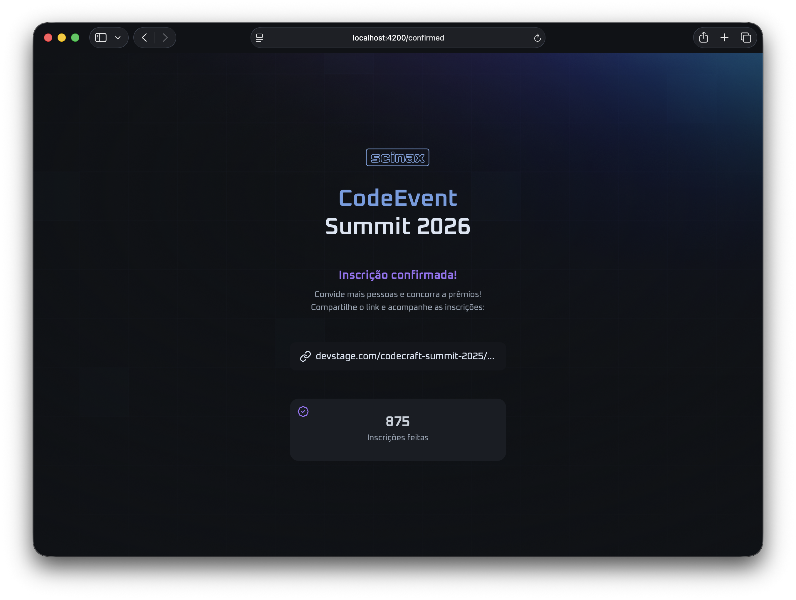

# Scinax

> Scinax é um género de anfíbios da família Hylidae, cujas espécies podem ser encontradas do México até a Argentina, além dos países insulares de Trinidad e Tobago e Santa Lúcia.

> Prova de conceito em Angular para uma landing page de evento, com arquitetura de componentes (atoms, molecules, organisms, pages, templates), integração de ícones e interface pronta para evolução.


---



---

## Visão Geral

O Scinax é uma prova de conceito construída com Angular, focada em componentização e experiência visual.

Hoje o projeto possui:

- Estrutura de UI organizada por responsabilidade (`atoms`, `molecules`, `organisms`, `pages`, `templates`)
- Página inicial e fluxo de confirmação com componentes reutilizáveis
- Integração com `@ng-icons` para ícones SVG
- Estilo escuro com variáveis CSS globais
- Base pronta para expansão para fluxo real de inscrição/convite

---

## Stack Tecnológica

### Frontend

- Angular 21
- TypeScript
- SCSS
- RxJS

### Ferramentas

- Angular CLI
- PNPM Workspaces
- Vitest

### Infra / Deploy

- Vercel (deploy estático)
- Assets estáticos em `app/public/`

---

## Estrutura do Projeto

```bash
.
├── .npmrc
├── README.md
├── package.json
├── pnpm-lock.yaml
├── pnpm-workspace.yaml
├── screenshot.png
└── app
    ├── angular.json
    ├── package.json
    ├── public
    └── src
        ├── app
        │   ├── app.config.ts
        │   ├── app.html
        │   ├── app.routes.ts
        │   ├── app.scss
        │   └── app.ts
        ├── components
        │   ├── atoms
        │   │   ├── card
        │   │   │   ├── card.html
        │   │   │   ├── card.scss
        │   │   │   └── card.ts
        │   │   └── toast
        │   │       ├── toast.html
        │   │       ├── toast.scss
        │   │       └── toast.ts
        │   ├── molecules
        │   │   └── input
        │   │       ├── input.html
        │   │       ├── input.scss
        │   │       └── input.ts
        │   ├── organisms
        │   ├── pages
        │   │   ├── confirmed
        │   │   │   ├── confirmed.html
        │   │   │   ├── confirmed.scss
        │   │   │   └── confirmed.ts
        │   │   └── home
        │   │       ├── home.html
        │   │       ├── home.scss
        │   │       └── home.ts
        │   └── templates
        │       └── default
        │           ├── default.html
        │           ├── default.scss
        │           └── default.ts
        ├── index.html
        ├── main.ts
        └── styles.scss
```

---

## Pré-requisitos

- Node.js 18+
- PNPM

---

## Instalação

Na raiz do projeto:

```bash
pnpm install
```

---

## Como Rodar em Desenvolvimento

```bash
pnpm --filter app start
```

Aplicação local:

- http://localhost:4200

---

## Build

```bash
pnpm --filter app build
```

---

## Componentes Principais

### Templates

Camada de layout base para composição das páginas.

- Exemplo: `default`
- Usa projeção de conteúdo com `ng-content`

### Pages

Componentes de página que orquestram os blocos de interface.

- Exemplo: `home` e `confirmed`
- Integram estados locais e ações de UI

### Atoms e Molecules

Componentes menores e reutilizáveis para montar estruturas maiores.

- Exemplo: `toast`, `input`, `card`
- Mantêm consistência visual e facilitam manutenção

---

## Conteúdo da Interface

A interface atual está dividida em seções de apresentação e confirmação:

- Apresentação do evento com informações principais
- Elementos interativos para compartilhamento
- Feedback visual via toast

O visual usa:

- Tema escuro com contraste controlado
- Ícones vetoriais com `@ng-icons/lucide`
- Tipografia e espaçamento voltados para legibilidade

---

## Deploy na Vercel

Este projeto pode ser publicado na Vercel com build do app Angular.

Observações importantes:

- O app está dentro da pasta `app/`
- O comando de build recomendado é `pnpm --filter app build`
- O output padrão do Angular (com configuração atual) é gerado pelo `ng build`

---

## Autor

Lucas Carinhanha

- GitHub: https://github.com/car1nhanha

---

Feito com código, conceito e cuidado visual.
